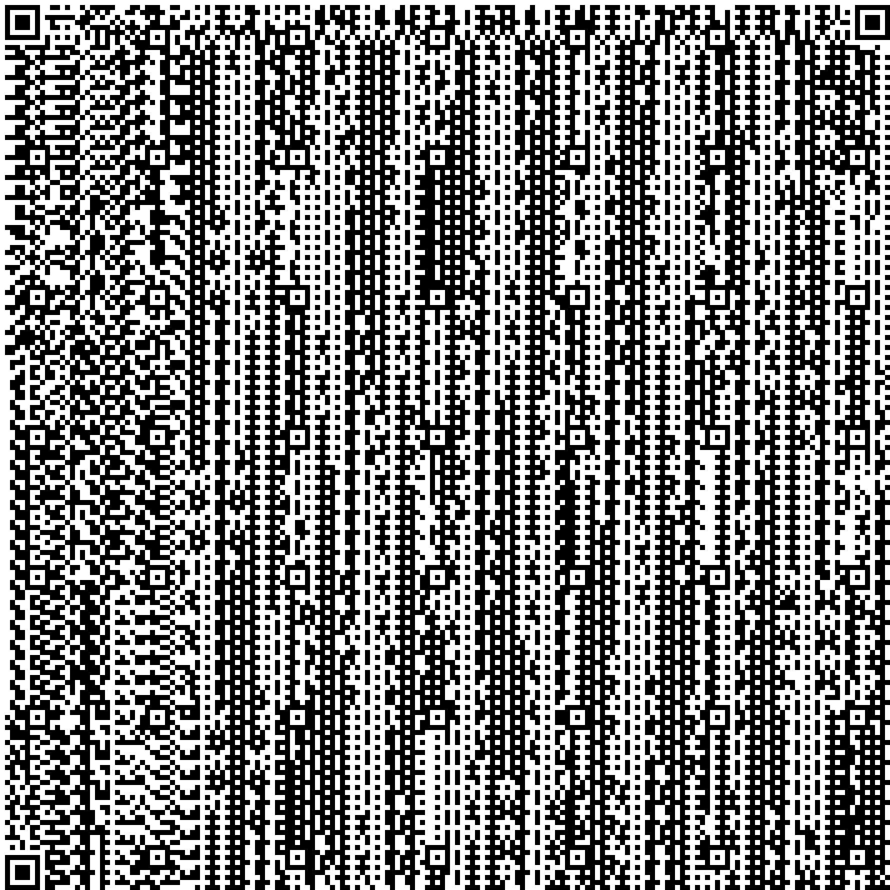

# qr
generator //https://www.thonky.com/qr-code-tutorial/generator-polynomial-tool?degree=10     
tutorials www.thonky.com    

[] - check penalties   
[] - type polymorphism 

   
   
   
   
   
   
   
